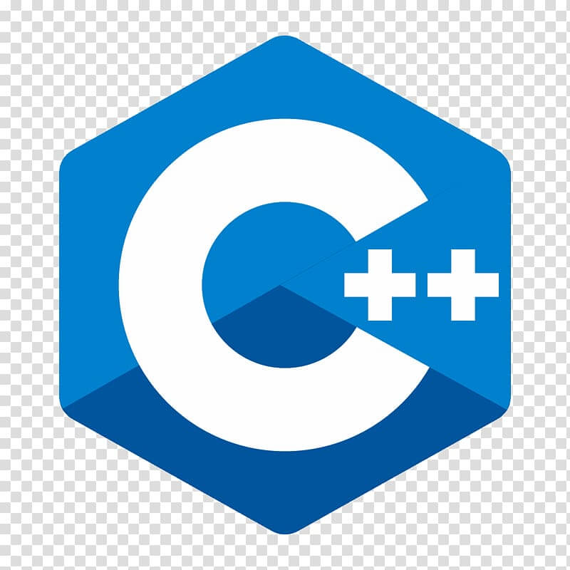

### Hi there 👋

<!--
**perqu/perqu** is a ✨ _special_ ✨ repository because its `README.md` (this file) appears on your GitHub profile.

Here are some ideas to get you started:

- 🔭 I’m currently working on ...
- 🌱 I’m currently learning ...
- 👯 I’m looking to collaborate on ...
- 🤔 I’m looking for help with ...
- 💬 Ask me about ...
- 📫 How to reach me: ...
- 😄 Pronouns: ...
- ⚡ Fun fact: ...
-->
### Welcome to my Github page aka [perqu] 👋

## A little bit about me:
- 📚 I graduated from the Poznań University of Technology with the title of an engineer(Bachelor of Engineering) in the field of automation and robotics
- Junior control system engineer at SII
- 🌱 I’m currently learning Python (advanced level)
- 😄 Hobbys: vr games, asg

### Connect with me:
- 📫 via mail: pawelkperenc@protonmail.com
- 📫 via [linkedin]

### Languages and tools:

[linkedin]: https://www.linkedin.com/in/pawe%C5%82-perenc-51b39315a/
[perqu]: https://github.com/perqu
